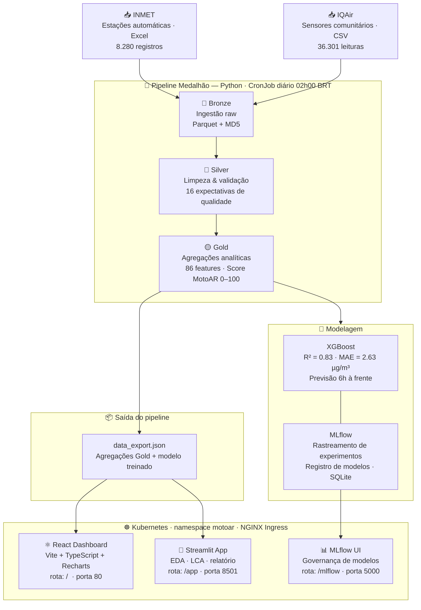
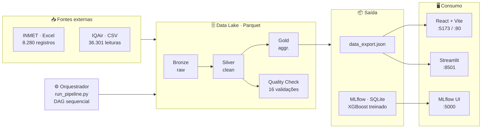

# 🏍️ MotoAR — Plataforma de Qualidade do Ar para Motociclistas de Brasília

> Projeto Integrador — Engenharia de Dados · UniCEUB · 2026  
> Prof. Luis Carlos Cardoso  
> **Alessandra Ferreira · Luiz Henrique · Rafael**

[](https://python.org)
[](https://react.dev)
[](https://xgboost.readthedocs.io)
[](https://mlflow.org)
[](https://kubernetes.io)
[](tests/)

---

## ⚡ Quick Start (5 minutos)

Quer executar o projeto rapidamente?

```bash
# 1. Clonar e entrar no diretório
cd motoar_final

# 2. Instalar dependências
pip install pandas numpy scikit-learn xgboost openpyxl pyarrow mlflow streamlit plotly

# 3. Executar o pipeline completo
python pipeline/orchestration/run_pipeline.py

# 4. Abrir o dashboard Streamlit
streamlit run dashboard/streamlit/motoar_app.py
# Acesse: http://localhost:8501
```

---

## 📊 Sobre o projeto

O **MotoAR** monitora e prevê a qualidade do ar no Distrito Federal combinando dados do **INMET** (estações automáticas, 8.280 registros) e **IQAir** (4 sensores comunitários, 36.301 leituras). O pipeline produz um **Score MotoAR 0–100** com recomendação de EPI para o motociclista.

### Arquitetura da Plataforma



---

## 🚀 Guia de Início — Passo a Passo

Siga cada seção na ordem para configurar e executar o projeto completo.

### **PASSO 1: Ambiente e Dependências**

#### 1.1 Verificar pré-requisitos instalados

```bash
python --version      # Deve ser 3.11+
pip --version         # Deve ser 9.0+
node --version        # Deve ser 18+
npm --version         # Deve ser 9+
```

Se algum não estiver instalado:
- **Python**: https://python.org (baixe 3.11+ e marque "Add to PATH")
- **Node/npm**: https://nodejs.org (escolha LTS)

#### 1.2 Criar ambiente virtual Python (recomendado)

```bash
# Windows (PowerShell)
python -m venv venv
.\venv\Scripts\Activate.ps1

# macOS/Linux
python3 -m venv venv
source venv/bin/activate
```

#### 1.3 Instalar dependências Python

```bash
# Todas as dependências de uma vez
pip install pandas numpy scikit-learn xgboost openpyxl pyarrow mlflow streamlit plotly reportlab pytest

# Ou instalar por grupo:
# - Pipeline
pip install pandas numpy scikit-learn xgboost openpyxl pyarrow mlflow

# - Frontend (React)
# Será feito no passo 3

# - Streamlit
pip install streamlit plotly reportlab

# - Testes
pip install pytest
```

✅ **Pronto!** Você tem todas as dependências necessárias.

---

### **PASSO 2: Executar o Pipeline de Dados**

O pipeline segue a arquitetura **Medalhão**: Bronze → Silver → Gold.

#### 2.1 Entender as camadas

| Camada | Responsabilidade | Entrada | Saída |
|---|---|---|---|
| **Bronze** | Ingestão bruta | `data/raw/` | Parquet sem transformação |
| **Silver** | Limpeza e validação | Bronze Parquet | Parquet limpo |
| **Quality** | 16 expectativas de qualidade | Silver Parquet | Relatório de qualidade |
| **Gold** | Agregações + Modelo XGBoost + MLflow | Silver limpo | `data_export.json` + modelo treinado |

#### 2.2 Executar pipeline completo (recomendado)

```bash
cd pipeline
python orchestration/run_pipeline.py
```

Isso executa **automaticamente** todas as camadas em ordem:

```
✓ Bronze: Ingestão INMET + IQAir
  └─ Saída: data/lake/bronze/
  
✓ Silver: Limpeza, validação, features
  └─ Saída: data/lake/silver/
  
✓ Quality: 16 expectativas validadas
  └─ Saída: pipeline/quality_check_output.json
  
✓ Gold: Agregações, modelo XGBoost, MLflow
  └─ Saída: data/data_export.json + MLflow artifacts
```

**Tempo esperado**: 2–5 minutos

#### 2.3 (Opcional) Executar camadas individualmente

Se quiser testar uma camada específica:

```bash
# Bronze — ingestão raw
python pipeline/bronze/bronze_ingest.py
# Saída: data/lake/bronze/inmet.parquet, iqair.parquet

# Silver — limpeza
python pipeline/silver/silver_transform.py
# Saída: data/lake/silver/transformed.parquet

# Quality — validação
python pipeline/quality/quality_check.py
# Saída: pipeline/quality_check_output.json

# Gold — agregações + modelo
python pipeline/gold/gold_build.py
# Saída: data/data_export.json + mlruns/
```

✅ **Pronto!** Seus dados estão no `data/data_export.json`.

---

### **PASSO 3: Configurar e Rodar o Dashboard React**

#### 3.1 Copiar dados para o frontend

```bash
# Do diretório raiz
cp data/data_export.json dashboard/react/src/data.json
```

#### 3.2 Instalar dependências Node

```bash
cd dashboard/react
npm install
```

Isso cria a pasta `node_modules/` com todas as libs React/Vite/Recharts.

**Tempo esperado**: 1–2 minutos

#### 3.3 Iniciar servidor de desenvolvimento

```bash
npm run dev
```

Saída esperada:
```
VITE v5.x.x  ready in xxx ms

➜  Local:   http://localhost:5173/
➜  press h + enter to show help
```

#### 3.4 Abrir no navegador

- Vá para **http://localhost:5173**
- Veja gráficos de qualidade do ar em tempo real
- Dados carregados do `data.json`

💡 **Dica**: Para parar o servidor, pressione `Ctrl+C` no terminal.

---

### **PASSO 4: Executar App Streamlit (Análise Interativa)**

O Streamlit permite explorar os dados com gráficos interativos e filtros.

#### 4.1 Abrir novo terminal

Mantenha o React rodando e abra outro terminal.

#### 4.2 Executar Streamlit

```bash
cd dashboard/streamlit
streamlit run motoar_app.py
```

Saída esperada:
```
Collecting usage statistics. To deactivate, set browser.gatherUsageStats to false.

You can now view your Streamlit app in your browser.

Local URL: http://localhost:8501
Network URL: http://192.168.x.x:8501
```

#### 4.3 Abrir no navegador

- Vá para **http://localhost:8501**
- Explore análises interativas
- Filtre por data, poluentes, estações

---

### **PASSO 5: Visualizar Experimentos MLflow**

MLflow rastreia todos os treinamentos do modelo XGBoost.

#### 5.1 Abrir novo terminal

#### 5.2 Iniciar UI do MLflow

```bash
mlflow ui --backend-store-uri sqlite:///data/mlruns/motoar.db
```

Saída esperada:
```
[YYYY-MM-DD HH:MM:SS +0000] [X] [cli.py:X] INFO: Listening at:
http://127.0.0.1:5000
```

#### 5.3 Abrir no navegador

- Vá para **http://localhost:5000**
- Veja histórico de treinamentos
- Compare métricas (MAE, R², loss)
- Acesse artefatos (modelo salvo, parâmetros)

---

### **PASSO 6: Executar Testes Unitários**

Valide que tudo funciona corretamente com 76 testes automatizados.

```bash
pytest tests/test_motoar.py -v
```

Saída esperada:
```
tests/test_motoar.py::test_bronze_ingest PASSED           [  1%]
tests/test_motoar.py::test_silver_transform PASSED        [  3%]
...
tests/test_motoar.py::test_gold_model_predict PASSED      [100%]

====================== 76 passed in 12.34s ======================
```

✅ Todos os 76 testes passando = projeto estável.

---

### **PASSO 7 (Opcional): Deploy Kubernetes**

Para produção, faça o deploy em Kubernetes.

#### 7.1 Pré-requisitos

- Docker instalado
- Kubernetes rodando (Docker Desktop, Minikube, ou cluster)
- `kubectl` configurado

#### 7.2 Build e deploy

```bash
cd infra

# Windows: usar bash ou WSL
bash deploy.sh
```

Ou no Bash/WSL:
```bash
chmod +x deploy.sh
./deploy.sh           # build + apply + status
./deploy.sh status    # ver pods rodando
./deploy.sh logs pipeline
```

#### 7.3 Endpoints após deploy

```
http://motoar.local           → Dashboard React
http://motoar.local/app       → Streamlit
http://motoar.local/mlflow    → MLflow UI
```

Adicione ao seu `/etc/hosts` (ou `C:\Windows\System32\drivers\etc\hosts` no Windows):
```
127.0.0.1  motoar.local
```

```
motoar/
│
├── pipeline/                    # Pipeline de dados (Arquitetura Medalhão)
│   ├── motoar_pipeline.py       # Pipeline legado (compatibilidade)
│   ├── bronze/
│   │   └── bronze_ingest.py     # Camada Bronze — ingestão sem esquema
│   ├── silver/
│   │   └── silver_transform.py  # Camada Silver — limpeza e validação
│   ├── gold/
│   │   ├── gold_build.py        # Camada Gold — agregações + XGBoost + MLflow
│   │   └── build_data.py        # Gerador de data_export.json (legado)
│   ├── quality/
│   │   └── quality_check.py     # 16 expectativas de qualidade (GE-style)
│   └── orchestration/
│       └── run_pipeline.py      # Orquestrador DAG: Bronze→Silver→Quality→Gold
│
├── dashboard/
│   ├── react/                   # Dashboard React + Vite + Recharts
│   │   ├── src/
│   │   │   ├── App.tsx
│   │   │   └── data.json        # Agregações Gold para o frontend
│   │   └── package.json
│   └── streamlit/               # App de análise interativa
│       ├── motoar_app.py
│       └── motoar_app2.py
│
├── infra/                       # Infraestrutura
│   ├── Dockerfile.pipeline      # Imagem do pipeline
│   ├── Dockerfile.streamlit     # Imagem do Streamlit
│   ├── Dockerfile.frontend      # Imagem do React (nginx)
│   ├── requirements-pipeline.txt
│   ├── requirements-streamlit.txt
│   ├── deploy.sh                # Script de deploy completo
│   └── k8s/                     # Manifests Kubernetes
│       ├── base/
│       │   ├── namespace.yaml   # Namespace motoar
│       │   ├── storage.yaml     # PV + PVC (10Gi)
│       │   ├── configmap.yaml   # Variáveis de ambiente
│       │   └── ingress.yaml     # Roteamento externo
│       ├── pipeline/
│       │   └── cronjob.yaml     # Pipeline diário 02h + Job manual
│       ├── streamlit/
│       │   └── deployment.yaml
│       ├── frontend/
│       │   ├── deployment.yaml
│       │   ├── hpa.yaml         # Auto-scaling 2–6 réplicas
│       │   └── nginx.conf
│       └── mlflow/
│           └── deployment.yaml
│
├── data/
│   ├── raw/                     # Dados brutos originais
│   │   ├── ESTACOES AUTOMATICAS _ DADOS BRUTO 2025.xlsx
│   │   └── iqair_data.csv
│   └── data_export.json         # Agregações Gold prontas para o dashboard
│
├── tests/
│   └── test_motoar.py           # 76 testes unitários (pytest)
│
├── docs/
│   ├── EDA_LCA_Cruzamentos.pdf
│   └── motoar_relatorio_completo.pdf
│
└── README.md
```

---

## 🏗️ Arquitetura As-Built — Medalhão



### Mudanças em relação ao plano original (Parte 1)

| Planejado | Implementado | Justificativa |
|---|---|---|
| Apache Spark | Pandas | Volume ~45k registros não justifica cluster |
| Delta Lake | Parquet em pastas | Mesma semântica, zero infraestrutura |
| Apache Airflow | `run_pipeline.py` DAG | Sem Docker/scheduler adicional |
| Great Expectations | `quality_check.py` | 16 expectativas nativas, saída compatível |
| FastAPI | — | Fora do escopo da Parte 2 |

---

## 🔧 Troubleshooting

### Problema: `ModuleNotFoundError: No module named 'pandas'`

**Solução**: Instale as dependências
```bash
pip install pandas numpy scikit-learn xgboost openpyxl pyarrow
```

### Problema: Porta 5173 (React) já está em uso

**Solução**: Use outra porta ou mate o processo
```bash
# Ver processo usando porta 5173
netstat -ano | findstr 5173

# Ou deixar Vite usar porta aleatória
npm run dev -- --port 5174
```

### Problema: `streamlit: command not found`

**Solução**: Instale Streamlit
```bash
pip install streamlit plotly
```

### Problema: `mlflow: command not found`

**Solução**: Instale MLflow
```bash
pip install mlflow
```

### Problema: Arquivo `data_export.json` não existe

**Solução**: Execute o pipeline primeiro
```bash
python pipeline/orchestration/run_pipeline.py
```

### Problema: `chmod: O termo não é reconhecido` (Windows PowerShell)

**Solução**: Use bash ou WSL
```bash
# Se tiver Git Bash
bash -c "chmod +x deploy.sh && ./deploy.sh"

# Ou com WSL
wsl bash deploy.sh
```

---

## 📋 Checklist de Setup Completo

Marque cada item conforme completar:

- [ ] **Python 3.11+** e pip instalados
- [ ] **Node 18+** e npm instalados  
- [ ] Ambiente virtual criado e ativado
- [ ] Dependências Python instaladas (`pip install ...`)
- [ ] Pipeline executado (`python pipeline/orchestration/run_pipeline.py`)
- [ ] `data_export.json` gerado em `data/`
- [ ] Dados copiados para React (`cp data/data_export.json dashboard/react/src/data.json`)
- [ ] Dependências React instaladas (`npm install`)
- [ ] Dashboard React rodando (`npm run dev`)
- [ ] Streamlit rodando (`streamlit run dashboard/streamlit/motoar_app.py`)
- [ ] MLflow UI rodando (`mlflow ui ...`)
- [ ] Testes passando (`pytest tests/test_motoar.py -v`)
- [ ] Deploy Kubernetes (opcional) (`./deploy.sh`)

---

## Métricas do modelo

| Métrica | Valor |
|---|---|
| Algoritmo | XGBoost |
| MAE | **2.63 µg/m³** |
| R² | **0.83** |
| Features | 11 (hora sin/cos, mês sin/cos, lags, rolling, chuva, NO2, CO) |
| Treino | 6.624 registros |
| Teste | 1.656 registros |

---

## Stack

| Camada | Tecnologia |
|---|---|
| Ingestão | Python · pandas · openpyxl |
| Armazenamento | Parquet (pyarrow) · Data Lake local |
| Transformação | pandas · NumPy · features temporais |
| Qualidade | quality_check.py (Great Expectations-style) |
| Modelagem | XGBoost · scikit-learn |
| Governança | MLflow (SQLite backend) |
| Orquestração | run_pipeline.py (DAG sequencial) |
| Frontend | React 19 · TypeScript · Vite · Recharts |
| Análise | Streamlit · Plotly · ReportLab |
| Infra | Docker · Kubernetes · nginx |
| Testes | pytest (76 testes unitários) |

---

## 📚 Recursos Adicionais

### Documentação Técnica

- [EDA_LCA_Cruzamentos.pdf](docs/EDA_LCA_Cruzamentos.pdf) — Análise exploratória de dados
- [motoar_relatorio_completo.pdf](docs/motoar_relatorio_completo.pdf) — Relatório técnico completo

### Arquivos Importantes

- [pipeline/orchestration/run_pipeline.py](pipeline/orchestration/run_pipeline.py) — Orquestrador principal
- [pipeline/quality/quality_check.py](pipeline/quality/quality_check.py) — Validações de qualidade
- [pipeline/gold/gold_build.py](pipeline/gold/gold_build.py) — Treinamento XGBoost
- [dashboard/react/src/App.tsx](dashboard/react/src/App.tsx) — Frontend React
- [dashboard/streamlit/motoar_app.py](dashboard/streamlit/motoar_app.py) — App de análise

### Dados

- [data/raw/](data/raw/) — Dados brutos (INMET Excel + IQAir CSV)
- [data/data_export.json](data/data_export.json) — Agregações prontas para o dashboard

---

## 🎯 Próximas Etapas

Após executar o setup completo, você pode:

1. **Explorar os dados** — Abra o React dashboard e o Streamlit
2. **Ajustar o modelo** — Modifique features em `pipeline/gold/gold_build.py`
3. **Adicionar novos dados** — Coloque arquivos em `data/raw/`
4. **Deploy em produção** — Use o script `infra/deploy.sh` para Kubernetes
5. **Integrar com APIs** — Use os endpoints do MLflow para predições em tempo real

---

## 📞 Suporte

Se encontrar problemas:

1. Verifique a seção **Troubleshooting** acima
2. Confirme que todos os pré-requisitos estão instalados
3. Rodar testes: `pytest tests/test_motoar.py -v`
4. Verificar logs do pipeline: `cat pipeline/quality_check_output.json`

---

*Uso acadêmico. Projeto Integrador — Engenharia de Dados · UniCEUB · 2026*  
*Dados brutos pertencem ao **INMET** e **IQAir** — incluídos apenas para reprodução do trabalho.*
